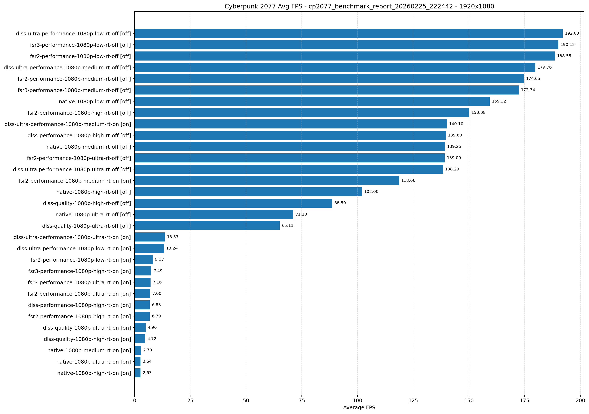
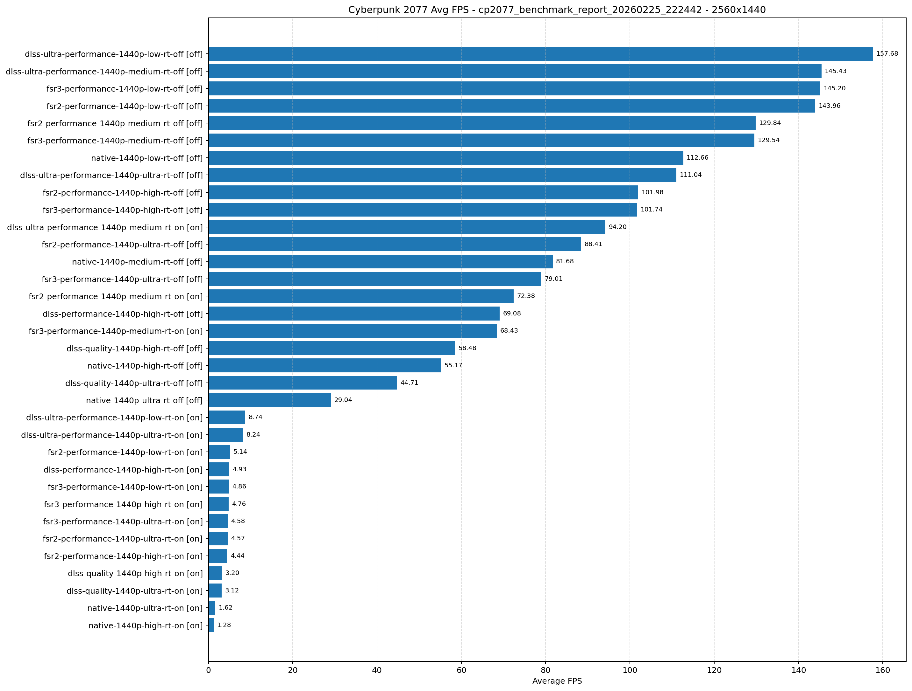

# Cyberpunk 2077 Benchmark Report

- Generated: 2026-02-25 22:24:43 IST
- Source directory: /home/pavel/Documents/GitHub/dolpa-gaming-on-linux/games/cyberpunk 2077/benchmark/results
- Mode: Latest result per test from JSON files
- GPU model(s): nvidia-geforce-rtx-5060
- GPU VRAM: 8151mb
- GPU driver(s): 590.48.01

| Test Name | Mode | Resolution | Quality | Ray Tracing | Frame Generation | GPU Model | GPU VRAM | Driver | Min FPS | Avg FPS | Max FPS |
|---|---|---|---|---|---|---|---|---|---:|---:|---:|
| native-1080p-low-rt-off | native | 1920x1080 | low | off | off | nvidia-geforce-rtx-5060 | 8151mb | 590.48.01 | 131.81 | 159.32 | 194.38 |
| dlss-ultra-performance-1080p-low-rt-off | dlss-ultra-performance | 1920x1080 | low | off | off | nvidia-geforce-rtx-5060 | 8151mb | 590.48.01 | 151.76 | 192.03 | 251.07 |
| dlss-ultra-performance-1080p-low-rt-on | dlss-ultra-performance | 1920x1080 | low | on | off | nvidia-geforce-rtx-5060 | 8151mb | 590.48.01 | 7.86 | 13.24 | 33.01 |
| fsr2-performance-1080p-low-rt-off | fsr2-performance | 1920x1080 | low | off | off | nvidia-geforce-rtx-5060 | 8151mb | 590.48.01 | 152.50 | 188.55 | 238.26 |
| fsr2-performance-1080p-low-rt-on | fsr2-performance | 1920x1080 | low | on | off | nvidia-geforce-rtx-5060 | 8151mb | 590.48.01 | 3.42 | 8.17 | 23.90 |
| fsr3-performance-1080p-low-rt-off | fsr3-performance | 1920x1080 | low | off | off | nvidia-geforce-rtx-5060 | 8151mb | 590.48.01 | 154.39 | 190.12 | 238.10 |
| native-1080p-medium-rt-off | native | 1920x1080 | medium | off | off | nvidia-geforce-rtx-5060 | 8151mb | 590.48.01 | 115.88 | 139.25 | 167.37 |
| native-1080p-medium-rt-on | native | 1920x1080 | medium | on | off | nvidia-geforce-rtx-5060 | 8151mb | 590.48.01 | 0.88 | 2.79 | 9.65 |
| dlss-ultra-performance-1080p-medium-rt-off | dlss-ultra-performance | 1920x1080 | medium | off | off | nvidia-geforce-rtx-5060 | 8151mb | 590.48.01 | 141.39 | 179.76 | 236.04 |
| dlss-ultra-performance-1080p-medium-rt-on | dlss-ultra-performance | 1920x1080 | medium | on | off | nvidia-geforce-rtx-5060 | 8151mb | 590.48.01 | 117.08 | 140.10 | 166.99 |
| fsr2-performance-1080p-medium-rt-off | fsr2-performance | 1920x1080 | medium | off | off | nvidia-geforce-rtx-5060 | 8151mb | 590.48.01 | 142.99 | 174.65 | 224.88 |
| fsr2-performance-1080p-medium-rt-on | fsr2-performance | 1920x1080 | medium | on | off | nvidia-geforce-rtx-5060 | 8151mb | 590.48.01 | 99.03 | 118.66 | 140.18 |
| fsr3-performance-1080p-medium-rt-off | fsr3-performance | 1920x1080 | medium | off | off | nvidia-geforce-rtx-5060 | 8151mb | 590.48.01 | 142.00 | 172.34 | 221.03 |
| native-1080p-high-rt-off | native | 1920x1080 | high | off | off | nvidia-geforce-rtx-5060 | 8151mb | 590.48.01 | 86.11 | 102.00 | 125.80 |
| native-1080p-high-rt-on | native | 1920x1080 | high | on | off | nvidia-geforce-rtx-5060 | 8151mb | 590.48.01 | 0.87 | 2.63 | 9.65 |
| dlss-quality-1080p-high-rt-off | dlss-quality | 1920x1080 | high | off | off | nvidia-geforce-rtx-5060 | 8151mb | 590.48.01 | 83.55 | 88.59 | 119.82 |
| dlss-quality-1080p-high-rt-on | dlss-quality | 1920x1080 | high | on | off | nvidia-geforce-rtx-5060 | 8151mb | 590.48.01 | 1.76 | 4.72 | 11.52 |
| dlss-performance-1080p-high-rt-off | dlss-performance | 1920x1080 | high | off | off | nvidia-geforce-rtx-5060 | 8151mb | 590.48.01 | 115.52 | 139.60 | 168.22 |
| dlss-performance-1080p-high-rt-on | dlss-performance | 1920x1080 | high | on | off | nvidia-geforce-rtx-5060 | 8151mb | 590.48.01 | 2.83 | 6.83 | 15.49 |
| fsr2-performance-1080p-high-rt-off | fsr2-performance | 1920x1080 | high | off | off | nvidia-geforce-rtx-5060 | 8151mb | 590.48.01 | 121.83 | 150.08 | 184.84 |
| fsr2-performance-1080p-high-rt-on | fsr2-performance | 1920x1080 | high | on | off | nvidia-geforce-rtx-5060 | 8151mb | 590.48.01 | 3.38 | 6.79 | 16.01 |
| fsr3-performance-1080p-high-rt-on | fsr3-performance | 1920x1080 | high | on | off | nvidia-geforce-rtx-5060 | 8151mb | 590.48.01 | 3.12 | 7.49 | 19.34 |
| native-1080p-ultra-rt-off | native | 1920x1080 | ultra | off | off | nvidia-geforce-rtx-5060 | 8151mb | 590.48.01 | 56.39 | 71.18 | 96.32 |
| native-1080p-ultra-rt-on | native | 1920x1080 | ultra | on | off | nvidia-geforce-rtx-5060 | 8151mb | 590.48.01 | 0.85 | 2.64 | 9.79 |
| dlss-quality-1080p-ultra-rt-off | dlss-quality | 1920x1080 | ultra | off | off | nvidia-geforce-rtx-5060 | 8151mb | 590.48.01 | 74.26 | 65.11 | 107.29 |
| dlss-quality-1080p-ultra-rt-on | dlss-quality | 1920x1080 | ultra | on | off | nvidia-geforce-rtx-5060 | 8151mb | 590.48.01 | 1.77 | 4.96 | 13.17 |
| dlss-ultra-performance-1080p-ultra-rt-off | dlss-ultra-performance | 1920x1080 | ultra | off | off | nvidia-geforce-rtx-5060 | 8151mb | 590.48.01 | 111.87 | 138.29 | 178.11 |
| dlss-ultra-performance-1080p-ultra-rt-on | dlss-ultra-performance | 1920x1080 | ultra | on | off | nvidia-geforce-rtx-5060 | 8151mb | 590.48.01 | 7.15 | 13.57 | 36.11 |
| fsr2-performance-1080p-ultra-rt-off | fsr2-performance | 1920x1080 | ultra | off | off | nvidia-geforce-rtx-5060 | 8151mb | 590.48.01 | 114.53 | 139.09 | 170.65 |
| fsr2-performance-1080p-ultra-rt-on | fsr2-performance | 1920x1080 | ultra | on | off | nvidia-geforce-rtx-5060 | 8151mb | 590.48.01 | 2.86 | 7.00 | 16.05 |
| fsr3-performance-1080p-ultra-rt-on | fsr3-performance | 1920x1080 | ultra | on | off | nvidia-geforce-rtx-5060 | 8151mb | 590.48.01 | 3.44 | 7.16 | 17.79 |
| native-1440p-low-rt-off | native | 2560x1440 | low | off | off | nvidia-geforce-rtx-5060 | 8151mb | 590.48.01 | 77.86 | 112.66 | 140.58 |
| dlss-ultra-performance-1440p-low-rt-off | dlss-ultra-performance | 2560x1440 | low | off | off | nvidia-geforce-rtx-5060 | 8151mb | 590.48.01 | 62.17 | 157.68 | 230.48 |
| dlss-ultra-performance-1440p-low-rt-on | dlss-ultra-performance | 2560x1440 | low | on | off | nvidia-geforce-rtx-5060 | 8151mb | 590.48.01 | 2.94 | 8.74 | 91.59 |
| fsr2-performance-1440p-low-rt-off | fsr2-performance | 2560x1440 | low | off | off | nvidia-geforce-rtx-5060 | 8151mb | 590.48.01 | 54.63 | 143.96 | 207.31 |
| fsr2-performance-1440p-low-rt-on | fsr2-performance | 2560x1440 | low | on | off | nvidia-geforce-rtx-5060 | 8151mb | 590.48.01 | 1.77 | 5.14 | 144.74 |
| fsr3-performance-1440p-low-rt-off | fsr3-performance | 2560x1440 | low | off | off | nvidia-geforce-rtx-5060 | 8151mb | 590.48.01 | 55.24 | 145.20 | 208.91 |
| fsr3-performance-1440p-low-rt-on | fsr3-performance | 2560x1440 | low | on | off | nvidia-geforce-rtx-5060 | 8151mb | 590.48.01 | 1.54 | 4.86 | 143.62 |
| native-1440p-medium-rt-off | native | 2560x1440 | medium | off | off | nvidia-geforce-rtx-5060 | 8151mb | 590.48.01 | 37.16 | 81.68 | 171.02 |
| dlss-ultra-performance-1440p-medium-rt-off | dlss-ultra-performance | 2560x1440 | medium | off | off | nvidia-geforce-rtx-5060 | 8151mb | 590.48.01 | 58.00 | 145.43 | 210.90 |
| dlss-ultra-performance-1440p-medium-rt-on | dlss-ultra-performance | 2560x1440 | medium | on | off | nvidia-geforce-rtx-5060 | 8151mb | 590.48.01 | 36.68 | 94.20 | 153.68 |
| fsr2-performance-1440p-medium-rt-off | fsr2-performance | 2560x1440 | medium | off | off | nvidia-geforce-rtx-5060 | 8151mb | 590.48.01 | 46.89 | 129.84 | 188.87 |
| fsr2-performance-1440p-medium-rt-on | fsr2-performance | 2560x1440 | medium | on | off | nvidia-geforce-rtx-5060 | 8151mb | 590.48.01 | 33.25 | 72.38 | 161.24 |
| fsr3-performance-1440p-medium-rt-off | fsr3-performance | 2560x1440 | medium | off | off | nvidia-geforce-rtx-5060 | 8151mb | 590.48.01 | 47.19 | 129.54 | 188.40 |
| fsr3-performance-1440p-medium-rt-on | fsr3-performance | 2560x1440 | medium | on | off | nvidia-geforce-rtx-5060 | 8151mb | 590.48.01 | 31.80 | 68.43 | 161.00 |
| native-1440p-high-rt-off | native | 2560x1440 | high | off | off | nvidia-geforce-rtx-5060 | 8151mb | 590.48.01 | 27.44 | 55.17 | 166.40 |
| native-1440p-high-rt-on | native | 2560x1440 | high | on | off | nvidia-geforce-rtx-5060 | 8151mb | 590.48.01 | 0.44 | 1.28 | 43.31 |
| dlss-quality-1440p-high-rt-off | dlss-quality | 2560x1440 | high | off | off | nvidia-geforce-rtx-5060 | 8151mb | 590.48.01 | 30.95 | 58.48 | 170.17 |
| dlss-quality-1440p-high-rt-on | dlss-quality | 2560x1440 | high | on | off | nvidia-geforce-rtx-5060 | 8151mb | 590.48.01 | 1.10 | 3.20 | 146.80 |
| dlss-performance-1440p-high-rt-off | dlss-performance | 2560x1440 | high | off | off | nvidia-geforce-rtx-5060 | 8151mb | 590.48.01 | 34.56 | 69.08 | 174.98 |
| dlss-performance-1440p-high-rt-on | dlss-performance | 2560x1440 | high | on | off | nvidia-geforce-rtx-5060 | 8151mb | 590.48.01 | 1.75 | 4.93 | 138.38 |
| fsr2-performance-1440p-high-rt-off | fsr2-performance | 2560x1440 | high | off | off | nvidia-geforce-rtx-5060 | 8151mb | 590.48.01 | 40.11 | 101.98 | 170.80 |
| fsr2-performance-1440p-high-rt-on | fsr2-performance | 2560x1440 | high | on | off | nvidia-geforce-rtx-5060 | 8151mb | 590.48.01 | 1.46 | 4.44 | 106.00 |
| fsr3-performance-1440p-high-rt-off | fsr3-performance | 2560x1440 | high | off | off | nvidia-geforce-rtx-5060 | 8151mb | 590.48.01 | 39.88 | 101.74 | 165.95 |
| fsr3-performance-1440p-high-rt-on | fsr3-performance | 2560x1440 | high | on | off | nvidia-geforce-rtx-5060 | 8151mb | 590.48.01 | 1.60 | 4.76 | 113.38 |
| native-1440p-ultra-rt-off | native | 2560x1440 | ultra | off | off | nvidia-geforce-rtx-5060 | 8151mb | 590.48.01 | 16.74 | 29.04 | 109.47 |
| native-1440p-ultra-rt-on | native | 2560x1440 | ultra | on | off | nvidia-geforce-rtx-5060 | 8151mb | 590.48.01 | 0.46 | 1.62 | 137.58 |
| dlss-quality-1440p-ultra-rt-off | dlss-quality | 2560x1440 | ultra | off | off | nvidia-geforce-rtx-5060 | 8151mb | 590.48.01 | 23.94 | 44.71 | 153.83 |
| dlss-quality-1440p-ultra-rt-on | dlss-quality | 2560x1440 | ultra | on | off | nvidia-geforce-rtx-5060 | 8151mb | 590.48.01 | 1.01 | 3.12 | 153.22 |
| dlss-ultra-performance-1440p-ultra-rt-off | dlss-ultra-performance | 2560x1440 | ultra | off | off | nvidia-geforce-rtx-5060 | 8151mb | 590.48.01 | 41.55 | 111.04 | 169.99 |
| dlss-ultra-performance-1440p-ultra-rt-on | dlss-ultra-performance | 2560x1440 | ultra | on | off | nvidia-geforce-rtx-5060 | 8151mb | 590.48.01 | 3.18 | 8.24 | 129.81 |
| fsr2-performance-1440p-ultra-rt-off | fsr2-performance | 2560x1440 | ultra | off | off | nvidia-geforce-rtx-5060 | 8151mb | 590.48.01 | 37.05 | 88.41 | 171.00 |
| fsr2-performance-1440p-ultra-rt-on | fsr2-performance | 2560x1440 | ultra | on | off | nvidia-geforce-rtx-5060 | 8151mb | 590.48.01 | 1.61 | 4.57 | 151.47 |
| fsr3-performance-1440p-ultra-rt-off | fsr3-performance | 2560x1440 | ultra | off | off | nvidia-geforce-rtx-5060 | 8151mb | 590.48.01 | 34.68 | 79.01 | 160.47 |
| fsr3-performance-1440p-ultra-rt-on | fsr3-performance | 2560x1440 | ultra | on | off | nvidia-geforce-rtx-5060 | 8151mb | 590.48.01 | 1.49 | 4.58 | 155.47 |

## Graphical Results

### 1920x1080

### 2560x1440

