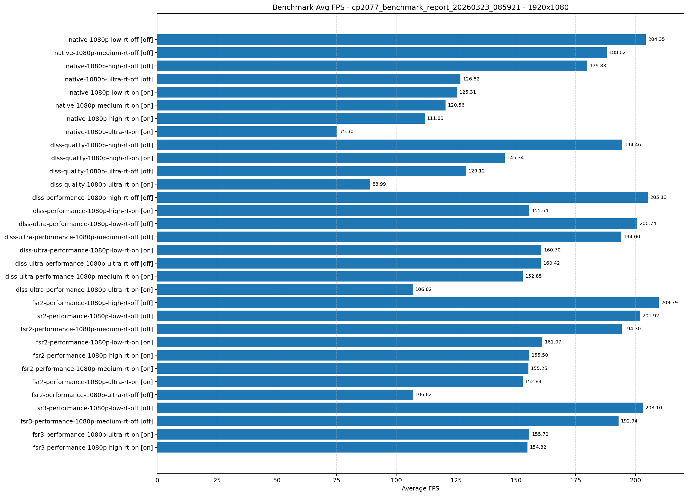
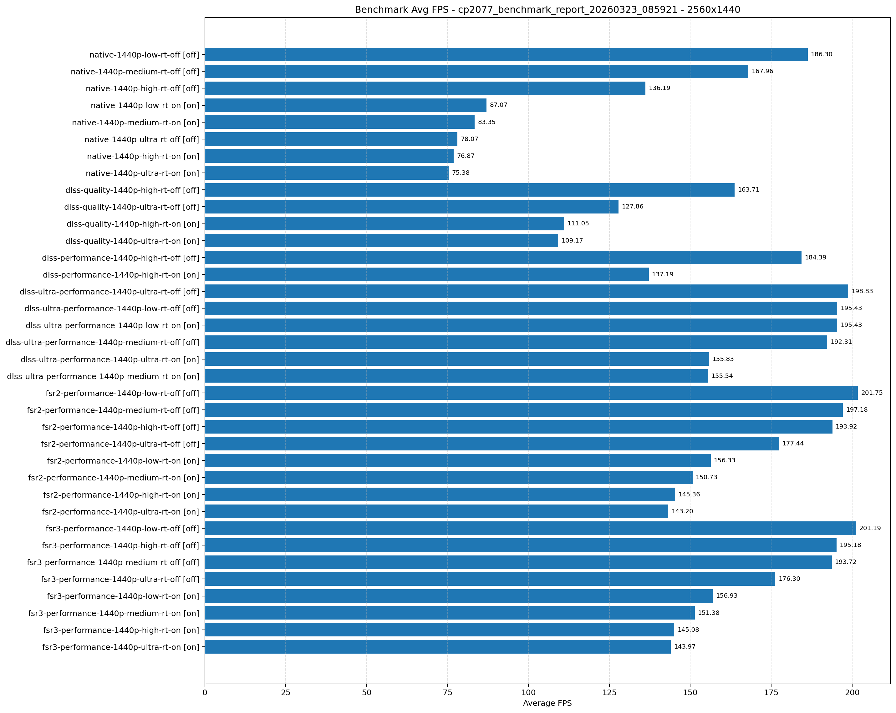
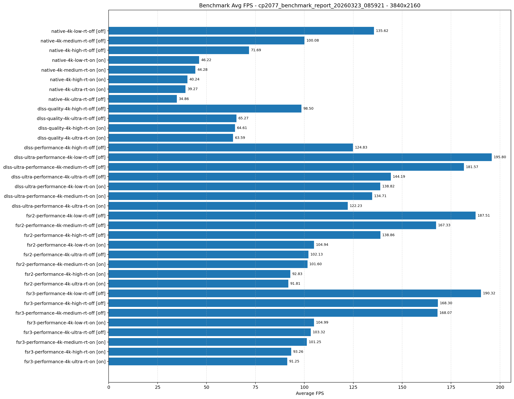

# Cyberpunk 2077 Benchmark Report

- Generated: 2026-03-23 08:59:23 IST
- Source directory: /home/pavel/Documents/GitHub/dolpa-gaming-on-linux/games/cyberpunk 2077/benchmark/results
- Mode: Latest result per test from JSON files
- OS: Ubuntu 24.04.4 LTS
- KERNEL: 6.17.0-14-generic
- CPU: Intel Core Ultra 7 265KF
- RAM: 48 GB
- GPU: NVIDIA GeForce RTX 5070Ti
- GPU DRIVER: NVIDIA 590.48.01
- GPU VRAM: 16303mb
- Proton: GE-Proton10-25

| Test Name | Mode | Resolution | Quality | Ray Tracing | Frame Generation | GPU Model | GPU VRAM | Driver | Min FPS | Avg FPS | Max FPS |
|---|---|---|---|---|---|---|---|---|---:|---:|---:|
| native-1080p-low-rt-off | native | 1920x1080 | low | off | off | nvidia-geforce-rtx-5070-ti | 16303mb | 590.48.01 | 155.72 | 204.35 | 264.50 |
| native-1080p-low-rt-on | native | 1920x1080 | low | on | off | nvidia-geforce-rtx-5070-ti | 16303mb | 590.48.01 | 106.62 | 125.31 | 149.33 |
| dlss-ultra-performance-1080p-low-rt-off | dlss-ultra-performance | 1920x1080 | low | off | off | nvidia-geforce-rtx-5070-ti | 16303mb | 590.48.01 | 153.15 | 200.74 | 259.86 |
| dlss-ultra-performance-1080p-low-rt-on | dlss-ultra-performance | 1920x1080 | low | on | off | nvidia-geforce-rtx-5070-ti | 16303mb | 590.48.01 | 138.97 | 160.70 | 194.41 |
| fsr2-performance-1080p-low-rt-off | fsr2-performance | 1920x1080 | low | off | off | nvidia-geforce-rtx-5070-ti | 16303mb | 590.48.01 | 153.93 | 201.92 | 258.18 |
| fsr2-performance-1080p-low-rt-on | fsr2-performance | 1920x1080 | low | on | off | nvidia-geforce-rtx-5070-ti | 16303mb | 590.48.01 | 139.61 | 161.07 | 193.70 |
| fsr3-performance-1080p-low-rt-off | fsr3-performance | 1920x1080 | low | off | off | nvidia-geforce-rtx-5070-ti | 16303mb | 590.48.01 | 154.63 | 203.10 | 263.32 |
| native-1080p-medium-rt-off | native | 1920x1080 | medium | off | off | nvidia-geforce-rtx-5070-ti | 16303mb | 590.48.01 | 141.82 | 188.02 | 253.11 |
| native-1080p-medium-rt-on | native | 1920x1080 | medium | on | off | nvidia-geforce-rtx-5070-ti | 16303mb | 590.48.01 | 103.31 | 120.56 | 142.21 |
| dlss-ultra-performance-1080p-medium-rt-off | dlss-ultra-performance | 1920x1080 | medium | off | off | nvidia-geforce-rtx-5070-ti | 16303mb | 590.48.01 | 144.26 | 194.00 | 260.38 |
| dlss-ultra-performance-1080p-medium-rt-on | dlss-ultra-performance | 1920x1080 | medium | on | off | nvidia-geforce-rtx-5070-ti | 16303mb | 590.48.01 | 131.90 | 152.85 | 185.20 |
| fsr2-performance-1080p-medium-rt-off | fsr2-performance | 1920x1080 | medium | off | off | nvidia-geforce-rtx-5070-ti | 16303mb | 590.48.01 | 141.94 | 194.30 | 263.58 |
| fsr2-performance-1080p-medium-rt-on | fsr2-performance | 1920x1080 | medium | on | off | nvidia-geforce-rtx-5070-ti | 16303mb | 590.48.01 | 133.71 | 155.25 | 187.89 |
| fsr3-performance-1080p-medium-rt-off | fsr3-performance | 1920x1080 | medium | off | off | nvidia-geforce-rtx-5070-ti | 16303mb | 590.48.01 | 143.26 | 192.94 | 259.34 |
| native-1080p-high-rt-off | native | 1920x1080 | high | off | off | nvidia-geforce-rtx-5070-ti | 16303mb | 590.48.01 | 150.24 | 179.83 | 232.32 |
| native-1080p-high-rt-on | native | 1920x1080 | high | on | off | nvidia-geforce-rtx-5070-ti | 16303mb | 590.48.01 | 96.42 | 111.83 | 129.54 |
| dlss-quality-1080p-high-rt-off | dlss-quality | 1920x1080 | high | off | off | nvidia-geforce-rtx-5070-ti | 16303mb | 590.48.01 | 153.97 | 194.46 | 249.54 |
| dlss-quality-1080p-high-rt-on | dlss-quality | 1920x1080 | high | on | off | nvidia-geforce-rtx-5070-ti | 16303mb | 590.48.01 | 125.75 | 145.34 | 165.95 |
| dlss-performance-1080p-high-rt-off | dlss-performance | 1920x1080 | high | off | off | nvidia-geforce-rtx-5070-ti | 16303mb | 590.48.01 | 157.79 | 205.13 | 255.59 |
| dlss-performance-1080p-high-rt-on | dlss-performance | 1920x1080 | high | on | off | nvidia-geforce-rtx-5070-ti | 16303mb | 590.48.01 | 134.28 | 155.64 | 188.99 |
| fsr2-performance-1080p-high-rt-off | fsr2-performance | 1920x1080 | high | off | off | nvidia-geforce-rtx-5070-ti | 16303mb | 590.48.01 | 162.03 | 209.79 | 261.25 |
| fsr2-performance-1080p-high-rt-on | fsr2-performance | 1920x1080 | high | on | off | nvidia-geforce-rtx-5070-ti | 16303mb | 590.48.01 | 133.56 | 155.50 | 189.25 |
| fsr3-performance-1080p-high-rt-on | fsr3-performance | 1920x1080 | high | on | off | nvidia-geforce-rtx-5070-ti | 16303mb | 590.48.01 | 133.46 | 154.82 | 188.59 |
| native-1080p-ultra-rt-off | native | 1920x1080 | ultra | off | off | nvidia-geforce-rtx-5070-ti | 16303mb | 590.48.01 | 109.97 | 126.82 | 163.43 |
| native-1080p-ultra-rt-on | native | 1920x1080 | ultra | on | off | nvidia-geforce-rtx-5070-ti | 16303mb | 590.48.01 | 65.71 | 75.30 | 85.48 |
| dlss-quality-1080p-ultra-rt-off | dlss-quality | 1920x1080 | ultra | off | off | nvidia-geforce-rtx-5070-ti | 16303mb | 590.48.01 | 109.39 | 129.12 | 155.39 |
| dlss-quality-1080p-ultra-rt-on | dlss-quality | 1920x1080 | ultra | on | off | nvidia-geforce-rtx-5070-ti | 16303mb | 590.48.01 | 77.37 | 88.99 | 102.08 |
| dlss-ultra-performance-1080p-ultra-rt-off | dlss-ultra-performance | 1920x1080 | ultra | off | off | nvidia-geforce-rtx-5070-ti | 16303mb | 590.48.01 | 132.67 | 160.42 | 190.07 |
| dlss-ultra-performance-1080p-ultra-rt-on | dlss-ultra-performance | 1920x1080 | ultra | on | off | nvidia-geforce-rtx-5070-ti | 16303mb | 590.48.01 | 92.40 | 106.82 | 125.00 |
| fsr2-performance-1080p-ultra-rt-off | fsr2-performance | 1920x1080 | ultra | off | off | nvidia-geforce-rtx-5070-ti | 16303mb | 590.48.01 | 92.40 | 106.82 | 125.00 |
| fsr2-performance-1080p-ultra-rt-on | fsr2-performance | 1920x1080 | ultra | on | off | nvidia-geforce-rtx-5070-ti | 16303mb | 590.48.01 | 132.42 | 152.84 | 189.12 |
| fsr3-performance-1080p-ultra-rt-on | fsr3-performance | 1920x1080 | ultra | on | off | nvidia-geforce-rtx-5070-ti | 16303mb | 590.48.01 | 133.90 | 155.72 | 189.62 |
| native-1440p-low-rt-off | native | 2560x1440 | low | off | off | nvidia-geforce-rtx-5070-ti | 16303mb | 590.48.01 | 152.51 | 186.30 | 230.58 |
| native-1440p-low-rt-on | native | 2560x1440 | low | on | off | nvidia-geforce-rtx-5070-ti | 16303mb | 590.48.01 | 76.09 | 87.07 | 102.79 |
| dlss-ultra-performance-1440p-low-rt-off | dlss-ultra-performance | 2560x1440 | low | off | off | nvidia-geforce-rtx-5070-ti | 16303mb | 590.48.01 | 152.86 | 195.43 | 249.31 |
| dlss-ultra-performance-1440p-low-rt-on | dlss-ultra-performance | 2560x1440 | low | on | off | nvidia-geforce-rtx-5070-ti | 16303mb | 590.48.01 | 152.86 | 195.43 | 249.31 |
| fsr2-performance-1440p-low-rt-off | fsr2-performance | 2560x1440 | low | off | off | nvidia-geforce-rtx-5070-ti | 16303mb | 590.48.01 | 154.48 | 201.75 | 259.17 |
| fsr2-performance-1440p-low-rt-on | fsr2-performance | 2560x1440 | low | on | off | nvidia-geforce-rtx-5070-ti | 16303mb | 590.48.01 | 136.72 | 156.33 | 182.48 |
| fsr3-performance-1440p-low-rt-off | fsr3-performance | 2560x1440 | low | off | off | nvidia-geforce-rtx-5070-ti | 16303mb | 590.48.01 | 155.18 | 201.19 | 257.89 |
| fsr3-performance-1440p-low-rt-on | fsr3-performance | 2560x1440 | low | on | off | nvidia-geforce-rtx-5070-ti | 16303mb | 590.48.01 | 136.72 | 156.93 | 180.93 |
| native-1440p-medium-rt-off | native | 2560x1440 | medium | off | off | nvidia-geforce-rtx-5070-ti | 16303mb | 590.48.01 | 144.07 | 167.96 | 198.66 |
| native-1440p-medium-rt-on | native | 2560x1440 | medium | on | off | nvidia-geforce-rtx-5070-ti | 16303mb | 590.48.01 | 72.88 | 83.35 | 97.96 |
| dlss-ultra-performance-1440p-medium-rt-off | dlss-ultra-performance | 2560x1440 | medium | off | off | nvidia-geforce-rtx-5070-ti | 16303mb | 590.48.01 | 145.19 | 192.31 | 257.86 |
| dlss-ultra-performance-1440p-medium-rt-on | dlss-ultra-performance | 2560x1440 | medium | on | off | nvidia-geforce-rtx-5070-ti | 16303mb | 590.48.01 | 133.97 | 155.54 | 188.23 |
| fsr2-performance-1440p-medium-rt-off | fsr2-performance | 2560x1440 | medium | off | off | nvidia-geforce-rtx-5070-ti | 16303mb | 590.48.01 | 147.47 | 197.18 | 262.05 |
| fsr2-performance-1440p-medium-rt-on | fsr2-performance | 2560x1440 | medium | on | off | nvidia-geforce-rtx-5070-ti | 16303mb | 590.48.01 | 130.71 | 150.73 | 178.02 |
| fsr3-performance-1440p-medium-rt-off | fsr3-performance | 2560x1440 | medium | off | off | nvidia-geforce-rtx-5070-ti | 16303mb | 590.48.01 | 144.79 | 193.72 | 258.06 |
| fsr3-performance-1440p-medium-rt-on | fsr3-performance | 2560x1440 | medium | on | off | nvidia-geforce-rtx-5070-ti | 16303mb | 590.48.01 | 131.22 | 151.38 | 175.85 |
| native-1440p-high-rt-off | native | 2560x1440 | high | off | off | nvidia-geforce-rtx-5070-ti | 16303mb | 590.48.01 | 116.88 | 136.19 | 163.08 |
| native-1440p-high-rt-on | native | 2560x1440 | high | on | off | nvidia-geforce-rtx-5070-ti | 16303mb | 590.48.01 | 66.91 | 76.87 | 88.32 |
| dlss-quality-1440p-high-rt-off | dlss-quality | 2560x1440 | high | off | off | nvidia-geforce-rtx-5070-ti | 16303mb | 590.48.01 | 142.12 | 163.71 | 193.45 |
| dlss-quality-1440p-high-rt-on | dlss-quality | 2560x1440 | high | on | off | nvidia-geforce-rtx-5070-ti | 16303mb | 590.48.01 | 96.73 | 111.05 | 127.10 |
| dlss-performance-1440p-high-rt-off | dlss-performance | 2560x1440 | high | off | off | nvidia-geforce-rtx-5070-ti | 16303mb | 590.48.01 | 152.34 | 184.39 | 234.33 |
| dlss-performance-1440p-high-rt-on | dlss-performance | 2560x1440 | high | on | off | nvidia-geforce-rtx-5070-ti | 16303mb | 590.48.01 | 118.92 | 137.19 | 157.77 |
| fsr2-performance-1440p-high-rt-off | fsr2-performance | 2560x1440 | high | off | off | nvidia-geforce-rtx-5070-ti | 16303mb | 590.48.01 | 154.10 | 193.92 | 247.59 |
| fsr2-performance-1440p-high-rt-on | fsr2-performance | 2560x1440 | high | on | off | nvidia-geforce-rtx-5070-ti | 16303mb | 590.48.01 | 125.18 | 145.36 | 168.12 |
| fsr3-performance-1440p-high-rt-off | fsr3-performance | 2560x1440 | high | off | off | nvidia-geforce-rtx-5070-ti | 16303mb | 590.48.01 | 155.20 | 195.18 | 246.78 |
| fsr3-performance-1440p-high-rt-on | fsr3-performance | 2560x1440 | high | on | off | nvidia-geforce-rtx-5070-ti | 16303mb | 590.48.01 | 125.73 | 145.08 | 167.09 |
| native-1440p-ultra-rt-off | native | 2560x1440 | ultra | off | off | nvidia-geforce-rtx-5070-ti | 16303mb | 590.48.01 | 67.87 | 78.07 | 103.01 |
| native-1440p-ultra-rt-on | native | 2560x1440 | ultra | on | off | nvidia-geforce-rtx-5070-ti | 16303mb | 590.48.01 | 66.12 | 75.38 | 85.68 |
| dlss-quality-1440p-ultra-rt-off | dlss-quality | 2560x1440 | ultra | off | off | nvidia-geforce-rtx-5070-ti | 16303mb | 590.48.01 | 112.66 | 127.86 | 158.11 |
| dlss-quality-1440p-ultra-rt-on | dlss-quality | 2560x1440 | ultra | on | off | nvidia-geforce-rtx-5070-ti | 16303mb | 590.48.01 | 96.10 | 109.17 | 124.01 |
| dlss-ultra-performance-1440p-ultra-rt-off | dlss-ultra-performance | 2560x1440 | ultra | off | off | nvidia-geforce-rtx-5070-ti | 16303mb | 590.48.01 | 155.53 | 198.83 | 248.40 |
| dlss-ultra-performance-1440p-ultra-rt-on | dlss-ultra-performance | 2560x1440 | ultra | on | off | nvidia-geforce-rtx-5070-ti | 16303mb | 590.48.01 | 133.65 | 155.83 | 189.94 |
| fsr2-performance-1440p-ultra-rt-off | fsr2-performance | 2560x1440 | ultra | off | off | nvidia-geforce-rtx-5070-ti | 16303mb | 590.48.01 | 148.43 | 177.44 | 226.84 |
| fsr2-performance-1440p-ultra-rt-on | fsr2-performance | 2560x1440 | ultra | on | off | nvidia-geforce-rtx-5070-ti | 16303mb | 590.48.01 | 122.66 | 143.20 | 165.01 |
| fsr3-performance-1440p-ultra-rt-off | fsr3-performance | 2560x1440 | ultra | off | off | nvidia-geforce-rtx-5070-ti | 16303mb | 590.48.01 | 148.83 | 176.30 | 226.42 |
| fsr3-performance-1440p-ultra-rt-on | fsr3-performance | 2560x1440 | ultra | on | off | nvidia-geforce-rtx-5070-ti | 16303mb | 590.48.01 | 124.76 | 143.97 | 165.36 |
| native-4k-low-rt-off | native | 3840x2160 | low | off | off | nvidia-geforce-rtx-5070-ti | 16303mb | 590.48.01 | 119.12 | 135.62 | 161.57 |
| native-4k-low-rt-on | native | 3840x2160 | low | on | off | nvidia-geforce-rtx-5070-ti | 16303mb | 590.48.01 | 40.35 | 46.22 | 55.92 |
| dlss-ultra-performance-4k-low-rt-off | dlss-ultra-performance | 3840x2160 | low | off | off | nvidia-geforce-rtx-5070-ti | 16303mb | 590.48.01 | 152.81 | 195.80 | 247.92 |
| dlss-ultra-performance-4k-low-rt-on | dlss-ultra-performance | 3840x2160 | low | on | off | nvidia-geforce-rtx-5070-ti | 16303mb | 590.48.01 | 121.15 | 138.82 | 158.99 |
| fsr2-performance-4k-low-rt-off | fsr2-performance | 3840x2160 | low | off | off | nvidia-geforce-rtx-5070-ti | 16303mb | 590.48.01 | 150.91 | 187.51 | 229.72 |
| fsr2-performance-4k-low-rt-on | fsr2-performance | 3840x2160 | low | on | off | nvidia-geforce-rtx-5070-ti | 16303mb | 590.48.01 | 91.82 | 104.94 | 120.48 |
| fsr3-performance-4k-low-rt-off | fsr3-performance | 3840x2160 | low | off | off | nvidia-geforce-rtx-5070-ti | 16303mb | 590.48.01 | 155.58 | 190.32 | 230.15 |
| fsr3-performance-4k-low-rt-on | fsr3-performance | 3840x2160 | low | on | off | nvidia-geforce-rtx-5070-ti | 16303mb | 590.48.01 | 92.57 | 104.99 | 120.33 |
| native-4k-medium-rt-off | native | 3840x2160 | medium | off | off | nvidia-geforce-rtx-5070-ti | 16303mb | 590.48.01 | 89.08 | 100.08 | 113.95 |
| native-4k-medium-rt-on | native | 3840x2160 | medium | on | off | nvidia-geforce-rtx-5070-ti | 16303mb | 590.48.01 | 38.93 | 44.28 | 53.08 |
| dlss-ultra-performance-4k-medium-rt-off | dlss-ultra-performance | 3840x2160 | medium | off | off | nvidia-geforce-rtx-5070-ti | 16303mb | 590.48.01 | 143.58 | 181.57 | 228.06 |
| dlss-ultra-performance-4k-medium-rt-on | dlss-ultra-performance | 3840x2160 | medium | on | off | nvidia-geforce-rtx-5070-ti | 16303mb | 590.48.01 | 117.86 | 134.71 | 153.65 |
| fsr2-performance-4k-medium-rt-off | fsr2-performance | 3840x2160 | medium | off | off | nvidia-geforce-rtx-5070-ti | 16303mb | 590.48.01 | 141.91 | 167.33 | 198.04 |
| fsr2-performance-4k-medium-rt-on | fsr2-performance | 3840x2160 | medium | on | off | nvidia-geforce-rtx-5070-ti | 16303mb | 590.48.01 | 89.58 | 101.60 | 116.15 |
| fsr3-performance-4k-medium-rt-off | fsr3-performance | 3840x2160 | medium | off | off | nvidia-geforce-rtx-5070-ti | 16303mb | 590.48.01 | 143.67 | 168.07 | 198.21 |
| fsr3-performance-4k-medium-rt-on | fsr3-performance | 3840x2160 | medium | on | off | nvidia-geforce-rtx-5070-ti | 16303mb | 590.48.01 | 89.10 | 101.25 | 115.86 |
| native-4k-high-rt-off | native | 3840x2160 | high | off | off | nvidia-geforce-rtx-5070-ti | 16303mb | 590.48.01 | 63.56 | 71.69 | 84.32 |
| native-4k-high-rt-on | native | 3840x2160 | high | on | off | nvidia-geforce-rtx-5070-ti | 16303mb | 590.48.01 | 35.40 | 40.24 | 47.16 |
| dlss-quality-4k-high-rt-off | dlss-quality | 3840x2160 | high | off | off | nvidia-geforce-rtx-5070-ti | 16303mb | 590.48.01 | 88.59 | 98.50 | 111.61 |
| dlss-quality-4k-high-rt-on | dlss-quality | 3840x2160 | high | on | off | nvidia-geforce-rtx-5070-ti | 16303mb | 590.48.01 | 57.43 | 64.61 | 73.23 |
| dlss-performance-4k-high-rt-off | dlss-performance | 3840x2160 | high | off | off | nvidia-geforce-rtx-5070-ti | 16303mb | 590.48.01 | 112.20 | 124.83 | 142.06 |
| fsr2-performance-4k-high-rt-off | fsr2-performance | 3840x2160 | high | off | off | nvidia-geforce-rtx-5070-ti | 16303mb | 590.48.01 | 121.02 | 138.86 | 161.83 |
| fsr2-performance-4k-high-rt-on | fsr2-performance | 3840x2160 | high | on | off | nvidia-geforce-rtx-5070-ti | 16303mb | 590.48.01 | 82.37 | 92.83 | 104.35 |
| fsr3-performance-4k-high-rt-off | fsr3-performance | 3840x2160 | high | off | off | nvidia-geforce-rtx-5070-ti | 16303mb | 590.48.01 | 145.02 | 168.30 | 200.63 |
| fsr3-performance-4k-high-rt-on | fsr3-performance | 3840x2160 | high | on | off | nvidia-geforce-rtx-5070-ti | 16303mb | 590.48.01 | 82.76 | 93.26 | 105.03 |
| native-4k-ultra-rt-off | native | 3840x2160 | ultra | off | off | nvidia-geforce-rtx-5070-ti | 16303mb | 590.48.01 | 29.43 | 34.86 | 46.51 |
| native-4k-ultra-rt-on | native | 3840x2160 | ultra | on | off | nvidia-geforce-rtx-5070-ti | 16303mb | 590.48.01 | 34.51 | 39.27 | 45.12 |
| dlss-quality-4k-ultra-rt-off | dlss-quality | 3840x2160 | ultra | off | off | nvidia-geforce-rtx-5070-ti | 16303mb | 590.48.01 | 57.86 | 65.27 | 82.87 |
| dlss-quality-4k-ultra-rt-on | dlss-quality | 3840x2160 | ultra | on | off | nvidia-geforce-rtx-5070-ti | 16303mb | 590.48.01 | 56.72 | 63.59 | 71.49 |
| dlss-ultra-performance-4k-ultra-rt-off | dlss-ultra-performance | 3840x2160 | ultra | off | off | nvidia-geforce-rtx-5070-ti | 16303mb | 590.48.01 | 122.44 | 144.19 | 174.06 |
| dlss-ultra-performance-4k-ultra-rt-on | dlss-ultra-performance | 3840x2160 | ultra | on | off | nvidia-geforce-rtx-5070-ti | 16303mb | 590.48.01 | 106.42 | 122.23 | 139.88 |
| fsr2-performance-4k-ultra-rt-off | fsr2-performance | 3840x2160 | ultra | off | off | nvidia-geforce-rtx-5070-ti | 16303mb | 590.48.01 | 89.54 | 102.13 | 127.44 |
| fsr2-performance-4k-ultra-rt-on | fsr2-performance | 3840x2160 | ultra | on | off | nvidia-geforce-rtx-5070-ti | 16303mb | 590.48.01 | 81.23 | 91.81 | 103.38 |
| fsr3-performance-4k-ultra-rt-off | fsr3-performance | 3840x2160 | ultra | off | off | nvidia-geforce-rtx-5070-ti | 16303mb | 590.48.01 | 90.99 | 103.32 | 127.38 |
| fsr3-performance-4k-ultra-rt-on | fsr3-performance | 3840x2160 | ultra | on | off | nvidia-geforce-rtx-5070-ti | 16303mb | 590.48.01 | 80.71 | 91.25 | 103.01 |

## Graphical Results

