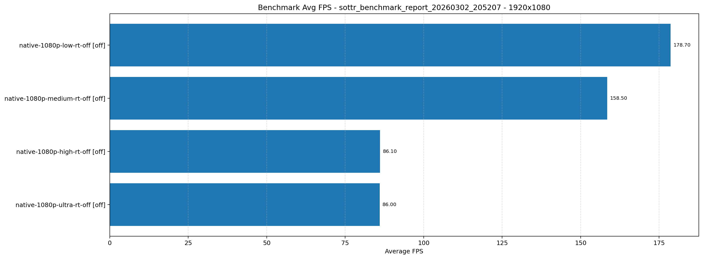
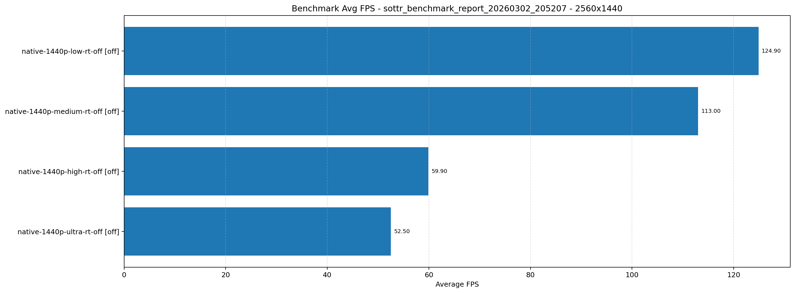
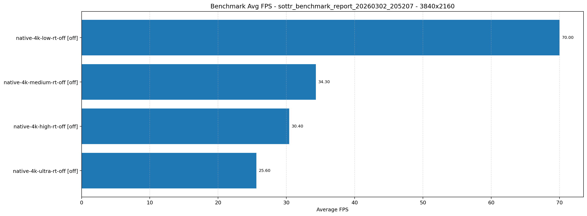

# Shadow of the Tomb Raider Benchmark Report

- Generated: 2026-03-02 20:52:07 IST
- JSON archive directory: /home/pavel/Documents/GitHub/dolpa-gaming-on-linux/games/tomb raider/benchmark/results
- Benchmark source directory: /home/pavel/.local/share/feral-interactive/Shadow of the Tomb Raider/SaveData
- Mode: Latest result per test from JSON files
- OS: Ubuntu 24.04.4 LTS
- KERNEL: 6.17.0-14-generic
- CPU: Intel Core Ultra 7 265KF
- RAM: 48 GB
- GPU: NVIDIA GeForce RTX 5060
- GPU DRIVER: NVIDIA 590.48.01
- GPU VRAM: 8151mb
- Proton: GE-Proton9-27

| Test Name | Mode | Resolution | Quality | Ray Tracing | Frame Generation | GPU Model | GPU VRAM | Driver | Min FPS | Avg FPS | Max FPS |
|---|---|---|---|---|---|---|---|---|---:|---:|---:|
| native-1080p-low-rt-off | native | 1920x1080 | low | off | off | nvidia-geforce-rtx-5060 | 8151mb | 590.48.01 | 0.00 | 178.70 | 288.40 |
| native-1080p-medium-rt-off | native | 1920x1080 | medium | off | off | nvidia-geforce-rtx-5060 | 8151mb | 590.48.01 | 0.00 | 158.50 | 270.50 |
| native-1080p-high-rt-off | native | 1920x1080 | high | off | off | nvidia-geforce-rtx-5060 | 8151mb | 590.48.01 | 0.00 | 86.10 | 188.40 |
| native-1080p-ultra-rt-off | native | 1920x1080 | ultra | off | off | nvidia-geforce-rtx-5060 | 8151mb | 590.48.01 | 0.00 | 86.00 | 173.70 |
| native-1440p-low-rt-off | native | 2560x1440 | low | off | off | nvidia-geforce-rtx-5060 | 8151mb | 590.48.01 | 0.00 | 124.90 | 187.30 |
| native-1440p-medium-rt-off | native | 2560x1440 | medium | off | off | nvidia-geforce-rtx-5060 | 8151mb | 590.48.01 | 0.00 | 113.00 | 175.00 |
| native-1440p-high-rt-off | native | 2560x1440 | high | off | off | nvidia-geforce-rtx-5060 | 8151mb | 590.48.01 | 0.00 | 59.90 | 105.40 |
| native-1440p-ultra-rt-off | native | 2560x1440 | ultra | off | off | nvidia-geforce-rtx-5060 | 8151mb | 590.48.01 | 0.00 | 52.50 | 112.30 |
| native-4k-low-rt-off | native | 3840x2160 | low | off | off | nvidia-geforce-rtx-5060 | 8151mb | 590.48.01 | 0.00 | 70.00 | 108.00 |
| native-4k-medium-rt-off | native | 3840x2160 | medium | off | off | nvidia-geforce-rtx-5060 | 8151mb | 590.48.01 | 0.00 | 34.30 | 73.80 |
| native-4k-high-rt-off | native | 3840x2160 | high | off | off | nvidia-geforce-rtx-5060 | 8151mb | 590.48.01 | 0.00 | 30.40 | 68.60 |
| native-4k-ultra-rt-off | native | 3840x2160 | ultra | off | off | nvidia-geforce-rtx-5060 | 8151mb | 590.48.01 | 0.00 | 25.60 | 60.70 |

## Graphical Results

