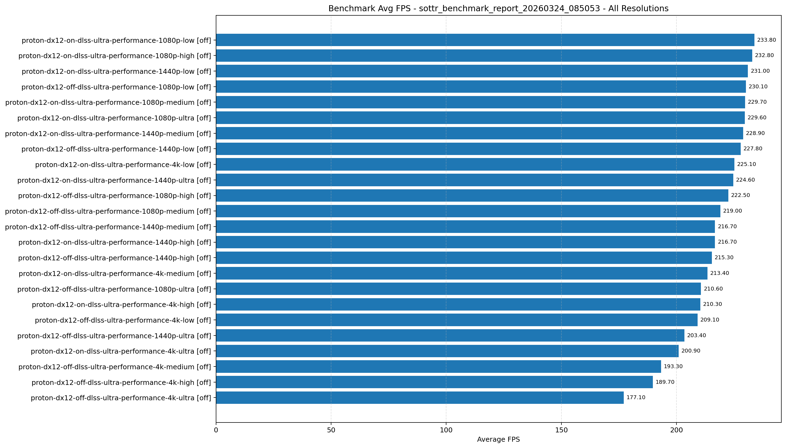
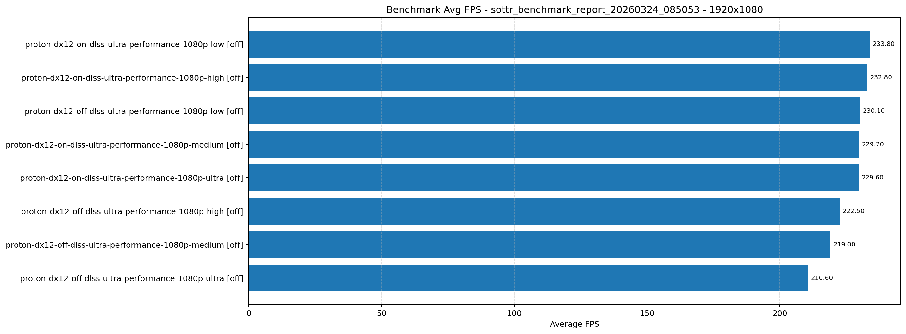
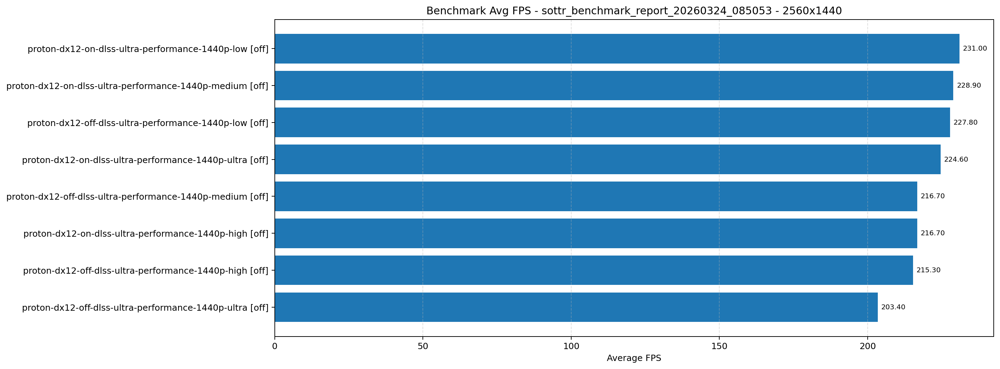
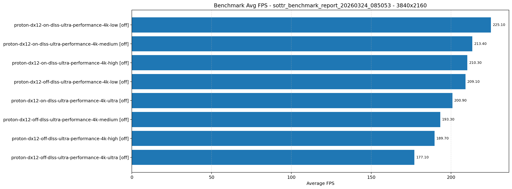

# Shadow of the Tomb Raider Benchmark Report

- Generated: 2026-03-24 08:50:54 IST
- JSON archive directory: /home/pavel/Documents/GitHub/dolpa-gaming-on-linux/games/tomb raider/benchmark/results
- Benchmark source directory: /home/pavel/.local/share/feral-interactive/Shadow of the Tomb Raider/SaveData
- Mode: Latest result per test from JSON files
- OS: Ubuntu 24.04.4 LTS
- KERNEL: 6.17.0-14-generic
- CPU: Intel Core Ultra 7 265KF
- RAM: 48 GB
- GPU: NVIDIA GeForce RTX 5070 Ti
- GPU DRIVER: NVIDIA 590.48.01
- GPU VRAM: 16303mb
- Proton: GE-Proton9-27

| Test Name | Mode | Resolution | Quality | Ray Tracing | Frame Generation | GPU Model | GPU VRAM | Driver | Min FPS | Avg FPS | Max FPS |
|---|---|---|---|---|---|---|---|---|---:|---:|---:|
| proton-dx12-on-dlss-ultra-performance-1080p-low | dlss-ultra-performance | 1920x1080 | low | off | off on | nvidia-geforce-rtx-5070-ti | 16303mb | 590.48.01 | 0.00 | 233.80 | 331.00 |
| proton-dx12-off-dlss-ultra-performance-1080p-low | dlss-ultra-performance | 1920x1080 | low | off | off off | nvidia-geforce-rtx-5070-ti | 16303mb | 590.48.01 | 0.00 | 230.10 | 399.30 |
| proton-dx12-on-dlss-ultra-performance-1080p-medium | dlss-ultra-performance | 1920x1080 | medium | off | off on | nvidia-geforce-rtx-5070-ti | 16303mb | 590.48.01 | 0.00 | 229.70 | 327.90 |
| proton-dx12-off-dlss-ultra-performance-1080p-medium | dlss-ultra-performance | 1920x1080 | medium | off | off off | nvidia-geforce-rtx-5070-ti | 16303mb | 590.48.01 | 0.00 | 219.00 | 378.80 |
| proton-dx12-on-dlss-ultra-performance-1080p-high | dlss-ultra-performance | 1920x1080 | high | off | off on | nvidia-geforce-rtx-5070-ti | 16303mb | 590.48.01 | 0.00 | 232.80 | 329.90 |
| proton-dx12-off-dlss-ultra-performance-1080p-high | dlss-ultra-performance | 1920x1080 | high | off | off off | nvidia-geforce-rtx-5070-ti | 16303mb | 590.48.01 | 0.00 | 222.50 | 385.70 |
| proton-dx12-on-dlss-ultra-performance-1080p-ultra | dlss-ultra-performance | 1920x1080 | ultra | off | off on | nvidia-geforce-rtx-5070-ti | 16303mb | 590.48.01 | 0.00 | 229.60 | 327.80 |
| proton-dx12-off-dlss-ultra-performance-1080p-ultra | dlss-ultra-performance | 1920x1080 | ultra | off | off off | nvidia-geforce-rtx-5070-ti | 16303mb | 590.48.01 | 0.00 | 210.60 | 364.30 |
| proton-dx12-on-dlss-ultra-performance-1440p-low | dlss-ultra-performance | 2560x1440 | low | off | off on | nvidia-geforce-rtx-5070-ti | 16303mb | 590.48.01 | 0.00 | 231.00 | 329.20 |
| proton-dx12-off-dlss-ultra-performance-1440p-low | dlss-ultra-performance | 2560x1440 | low | off | off off | nvidia-geforce-rtx-5070-ti | 16303mb | 590.48.01 | 0.00 | 227.80 | 369.90 |
| proton-dx12-on-dlss-ultra-performance-1440p-medium | dlss-ultra-performance | 2560x1440 | medium | off | off on | nvidia-geforce-rtx-5070-ti | 16303mb | 590.48.01 | 0.00 | 228.90 | 333.10 |
| proton-dx12-off-dlss-ultra-performance-1440p-medium | dlss-ultra-performance | 2560x1440 | medium | off | off off | nvidia-geforce-rtx-5070-ti | 16303mb | 590.48.01 | 0.00 | 216.70 | 356.90 |
| proton-dx12-on-dlss-ultra-performance-1440p-high | dlss-ultra-performance | 2560x1440 | high | off | off on | nvidia-geforce-rtx-5070-ti | 16303mb | 590.48.01 | 0.00 | 216.70 | 356.90 |
| proton-dx12-off-dlss-ultra-performance-1440p-high | dlss-ultra-performance | 2560x1440 | high | off | off off | nvidia-geforce-rtx-5070-ti | 16303mb | 590.48.01 | 0.00 | 215.30 | 359.70 |
| proton-dx12-on-dlss-ultra-performance-1440p-ultra | dlss-ultra-performance | 2560x1440 | ultra | off | off on | nvidia-geforce-rtx-5070-ti | 16303mb | 590.48.01 | 0.00 | 224.60 | 321.80 |
| proton-dx12-off-dlss-ultra-performance-1440p-ultra | dlss-ultra-performance | 2560x1440 | ultra | off | off off | nvidia-geforce-rtx-5070-ti | 16303mb | 590.48.01 | 0.00 | 203.40 | 345.50 |
| proton-dx12-on-dlss-ultra-performance-4k-low | dlss-ultra-performance | 3840x2160 | low | off | off on | nvidia-geforce-rtx-5070-ti | 16303mb | 590.48.01 | 0.00 | 225.10 | 321.00 |
| proton-dx12-off-dlss-ultra-performance-4k-low | dlss-ultra-performance | 3840x2160 | low | off | off off | nvidia-geforce-rtx-5070-ti | 16303mb | 590.48.01 | 0.00 | 209.10 | 345.50 |
| proton-dx12-on-dlss-ultra-performance-4k-medium | dlss-ultra-performance | 3840x2160 | medium | off | off on | nvidia-geforce-rtx-5070-ti | 16303mb | 590.48.01 | 0.00 | 213.40 | 299.30 |
| proton-dx12-off-dlss-ultra-performance-4k-medium | dlss-ultra-performance | 3840x2160 | medium | off | off off | nvidia-geforce-rtx-5070-ti | 16303mb | 590.48.01 | 0.00 | 193.30 | 342.10 |
| proton-dx12-on-dlss-ultra-performance-4k-high | dlss-ultra-performance | 3840x2160 | high | off | off on | nvidia-geforce-rtx-5070-ti | 16303mb | 590.48.01 | 0.00 | 210.30 | 299.50 |
| proton-dx12-off-dlss-ultra-performance-4k-high | dlss-ultra-performance | 3840x2160 | high | off | off off | nvidia-geforce-rtx-5070-ti | 16303mb | 590.48.01 | 0.00 | 189.70 | 328.60 |
| proton-dx12-on-dlss-ultra-performance-4k-ultra | dlss-ultra-performance | 3840x2160 | ultra | off | off on | nvidia-geforce-rtx-5070-ti | 16303mb | 590.48.01 | 0.00 | 200.90 | 306.20 |
| proton-dx12-off-dlss-ultra-performance-4k-ultra | dlss-ultra-performance | 3840x2160 | ultra | off | off off | nvidia-geforce-rtx-5070-ti | 16303mb | 590.48.01 | 0.00 | 177.10 | 322.30 |

## Graphical Results

All resolutions:

1080p resolution:

1440p resolution:

4k resolution:
